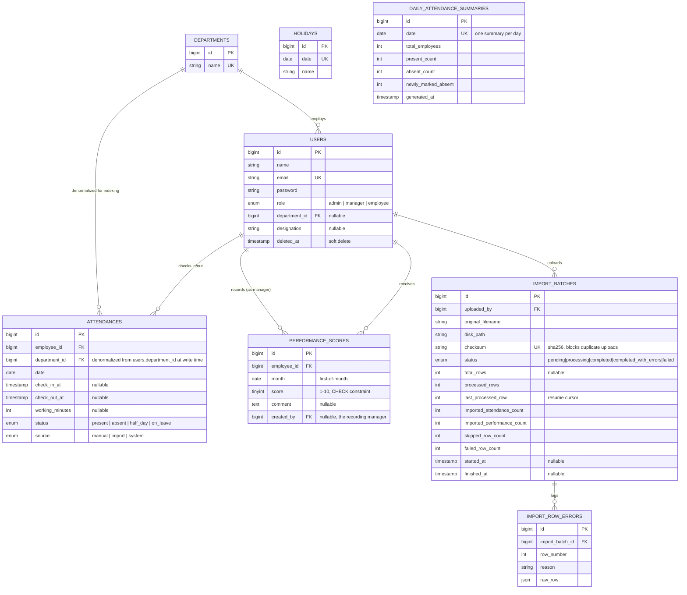

# Entity-Relationship Diagram

## Notable constraints (not visible in an ERD)

- `attendances`: `UNIQUE(employee_id, date)` - the DB-level guarantee against duplicate/concurrent check-ins.
- `attendances`: `INDEX(date, status, employee_id)` - covering index for analytics aggregation.
- `attendances`: `INDEX(department_id, date)` - the manager-listing query's index (see `docs/ARCHITECTURE.md`).
- `performance_scores`: `UNIQUE(employee_id, month)` + a `CHECK (score BETWEEN 1 AND 10)` constraint.
- `import_batches`: `UNIQUE(checksum)` - rejects a byte-identical re-upload before it's queued.

`users.department_id` and `attendances.department_id` are **not** kept in sync after the fact -
see `docs/ARCHITECTURE.md`'s note on why that's intentional.
